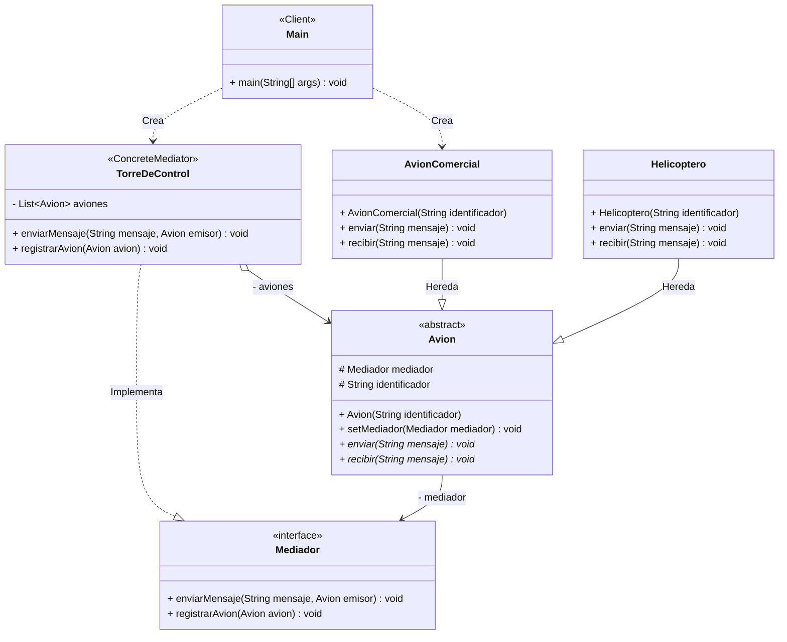

# Patrón Mediator (Mediador)

## 1. Diagrama UML

## 2. Problema
A medida que una aplicación crece, los objetos empiezan a comunicarse entre sí de forma directa. Esto genera un sistema donde todo está fuertemente acoplado (código espagueti): si cambias una clase, corres el riesgo de romper otras cinco con las que se comunicaba. Además, reutilizar un objeto en otro proyecto se vuelve imposible porque arrastra las dependencias de todos los demás objetos con los que habla.

## 3. Solución
El patrón Mediator propone detener toda comunicación directa entre los componentes. En su lugar, se introduce un objeto "Mediador" que actúa como un centro de comunicaciones (como la torre de control de un aeropuerto o el servidor de una sala de chat). Ahora, los componentes (llamados "Colegas") no se conocen entre sí; solo conocen al Mediador. Cuando un Colega quiere enviar información, se la pasa al Mediador, y este se encarga de redirigirla a quien corresponda.

## 4. Consecuencias
Positivas:

Desacoplamiento total: Los componentes ya no dependen unos de otros. Podés modificar, eliminar o reutilizar un componente (Colega) sin afectar al resto.

Principio de Responsabilidad Única: Toda la lógica de comunicación y coordinación está centralizada en un solo lugar (el Mediador), limpiando el código de los Colegas.

Simplifica las relaciones: Pasas de una red compleja de relaciones de muchos-a-muchos a una más sencilla de uno-a-muchos.

Negativas:

El anti-patrón "God Object" (Objeto Dios): Si no tenés cuidado, el Mediador puede volverse un monstruo gigantesco y monolítico que sabe y controla absolutamente todo en tu programa, siendo muy difícil de mantener.