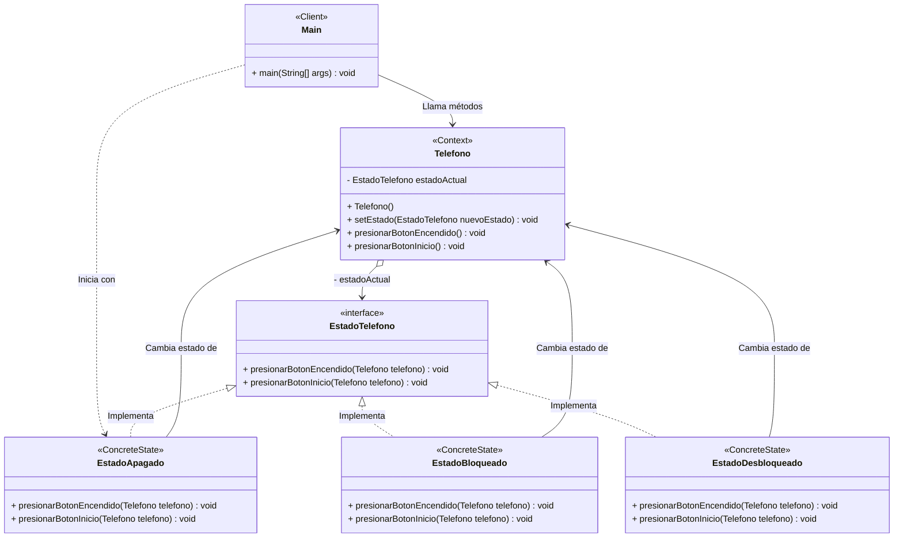

## Patrón State (Estado)

## 1. Diagrama UML

## 2. Problema
Imagina que tienes una clase que cambia su comportamiento dependiendo de su estado interno. Si implementas esto usando un bloque de código gigante con condicionales if-else o switch (por ejemplo: if (estado == APAGADO) { ... } else if (estado == BLOQUEADO) { ... }), la clase se volverá inmanejable. Si en el futuro necesitas agregar un nuevo estado, tendrás que modificar todos los métodos de esa clase, rompiendo el principio de Abierto/Cerrado (Open/Closed) de SOLID.

## 3. Solución
El patrón State sugiere aislar la lógica relacionada con los estados dentro de clases independientes.
En lugar de que el objeto original ("Contexto") realice las acciones por sí mismo basado en condicionales, este guarda una referencia a un objeto de estado y le delega el trabajo. Para cambiar el estado del contexto, simplemente reemplazas el objeto de estado actual por otro objeto que represente el nuevo estado.

## 4. Consecuencias
Positivas:

Principio de Responsabilidad Única: Organiza el código relacionado con estados particulares en clases separadas, limpiando la clase principal.

Principio de Abierto/Cerrado: Permite introducir nuevos estados sin cambiar las clases de estado existentes ni el contexto.

Código más limpio: Simplifica drásticamente el código del contexto al eliminar condicionales gigantescos y máquinas de estado complejas (los feos switch/case).

Negativas:

Aplicar el patrón puede ser excesivo (overkill) si tu máquina de estados tiene pocos estados o casi nunca cambia, ya que habrás creado muchas clases innecesarias.