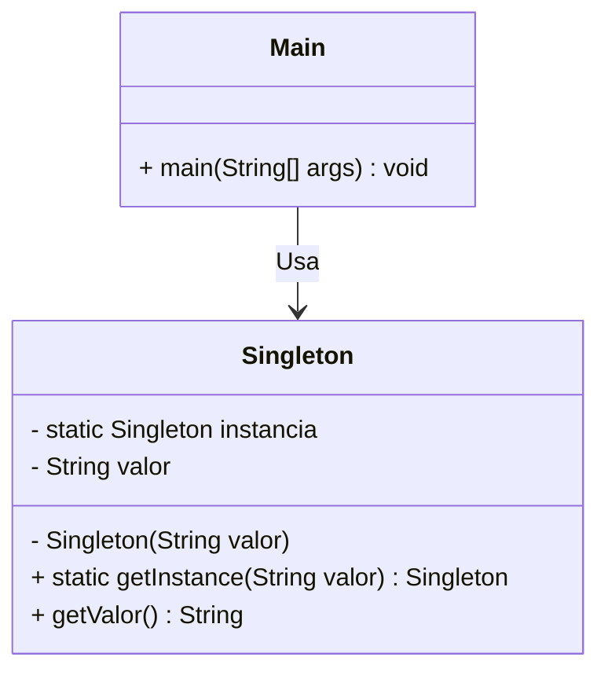

# Patrón Singleton

## 1. Diagrama UML

## 2. Problema

En muchos sistemas, es fundamental garantizar que solo exista una única instancia de una clase en toda la aplicación y proporcionar un punto de acceso global a ella. Por ejemplo, un objeto que maneje la conexión a la base de datos de la facultad. Si permitimos que se instancie múltiples veces, podríamos generar sobrecarga de conexiones, inconsistencias en los datos o agotar la memoria. Usar variables globales estándar no soluciona esto, ya que cualquier parte del código podría sobrescribirlas o crear nuevas instancias con el operador new.

## 3. Solución
El patrón Singleton resuelve esto encapsulando la creación del objeto dentro de su propia clase:

Constructor privado: Se oculta el constructor por defecto para evitar que otras clases instancien el objeto de forma directa.

Método de creación estático (getInstance()): Se proporciona un método público estático que actúa como constructor. Este método comprueba si ya existe una instancia en una variable privada estática; si no existe, la crea. Si ya existe, simplemente devuelve la instancia previamente guardada en caché.

## 4. Consecuencias
Positivas:

Tienes la certeza absoluta de que solo hay una instancia de la clase.

Obtienes un punto de acceso global y seguro a esa instancia.

Lazy Initialization (Inicialización diferida): El objeto solo ocupa memoria la primera vez que se solicita.

Negativas:

Rompe el Principio de Responsabilidad Única (SOLID), ya que la clase hace dos cosas: controla su propia creación y ejecuta su lógica de negocio.

Puede requerir sincronización extra en entornos multihilo (multithreading) para evitar que dos hilos creen la primera instancia exactamente al mismo tiempo.