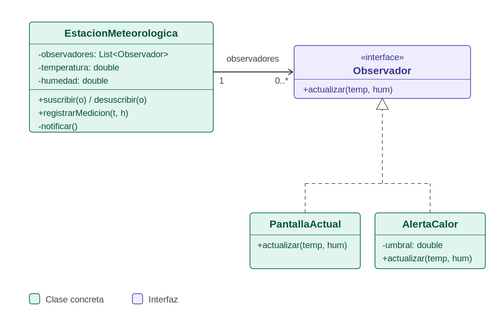

# Patrón Observer

Define una dependencia uno-a-muchos: cuando el sujeto cambia de estado,
notifica automáticamente a todos sus observadores.

## Diagrama UML

## Clases

- Observador: interfaz con el método actualizar.
- EstacionMeteorologica: sujeto, guarda el estado y la lista de observadores.
- PantallaActual: observador que muestra los datos.
- AlertaCalor: observador que avisa si la temperatura supera un umbral.
- MainObservador: cliente que crea los objetos, los suscribe y prueba el patrón.

## Problema

Un objeto (la estación meteorológica) tiene un estado que les interesa a otros
objetos (una pantalla, una alerta de calor). Las dos formas más directas de
resolverlo tienen fallas:

- Que los interesados consulten a la estación todo el tiempo (polling). La
  mayoría de las consultas no traen datos nuevos, así que se desperdicia
  trabajo, y además pueden enterarse tarde de un cambio.
- Que la estación llame directamente a cada clase interesada. Queda acoplada a
  todas ellas, y cada vez que aparece un interesado nuevo hay que modificarla.

A esto se suma que no se sabe de antemano cuántos interesados habrá, ni se los
puede agregar o quitar mientras el programa está corriendo.

## Solución

Se agrega a la estación (el notificador) un mecanismo de suscripción: una lista
de observadores y los métodos suscribir y desuscribir. Cuando el estado cambia
(registrarMedicion), la estación recorre la lista y llama al método actualizar
de cada observador, pasándole los datos del cambio (temperatura y humedad).

Para que la estación no dependa de clases concretas, todos los observadores
implementan la misma interfaz (Observador) y la estación se comunica con ellos
únicamente a través de ella.

Participantes en este proyecto:

- Observador: interfaz con el método actualizar.
- EstacionMeteorologica: notificador. Guarda el estado y la lista de
  observadores, y los avisa cuando cambia.
- PantallaActual y AlertaCalor: observadores concretos. Cada uno reacciona a su
  manera ante la misma notificación.
- MainObservador: cliente. Crea la estación y los observadores, y los suscribe.

## Consecuencias

Ventajas:

- Principio abierto/cerrado: se pueden agregar observadores nuevos sin
  modificar la estación.
- Bajo acoplamiento: la estación solo conoce la interfaz Observador, no las
  clases concretas.
- Relaciones dinámicas: los observadores se suscriben y se desuscriben en
  tiempo de ejecución (en el ejemplo, la pantalla se desuscribe y deja de
  recibir datos).

Desventajas:

- El orden de notificación no está garantizado, por lo que ningún observador
  debe depender de él.
- Si un observador no se desuscribe, la estación sigue referenciándolo y no se
  libera de memoria.
- Con muchos observadores, un solo cambio dispara muchas acciones y el flujo de
  ejecución se vuelve más difícil de seguir al depurar.

## Referencia

Refactoring.Guru, patrón Observer:
https://refactoring.guru/es/design-patterns/observer