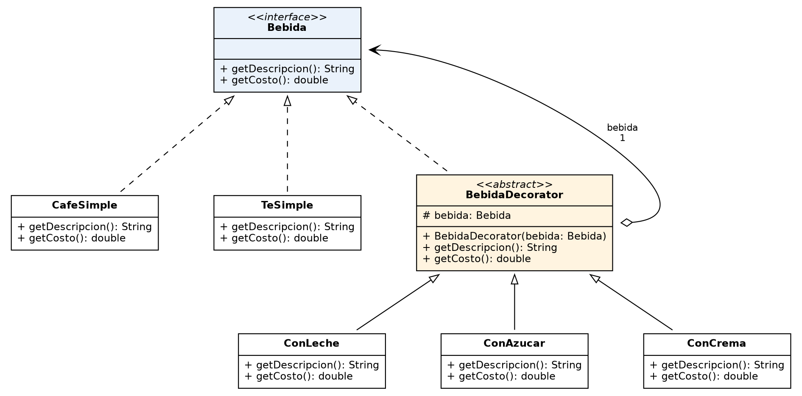

# Decorator



**Propósito:** Decorator es un patrón estructural que permite añadir funcionalidades a un objeto colocándolo dentro de objetos "envoltorio" (wrappers) que contienen esas funcionalidades.

## Problema

Imaginá una biblioteca de notificaciones. Al inicio tiene una clase `Notificador` con un método `send` que envía mensajes por correo electrónico.

Con el tiempo, los usuarios piden otros canales: SMS, Facebook, Slack. La primera idea es crear una subclase de `Notificador` por cada canal.

Después surge una necesidad real: usar varios canales a la vez (por ejemplo, email + SMS + Slack). Para eso habría que crear subclases que combinen canales (`NotificadorEmailSMS`, `NotificadorSMSSlack`, etc.). Esto provoca:

- **Explosión combinatoria de subclases:** con cada canal nuevo, el número de clases crece enormemente.
- **Código inflado**, tanto en la biblioteca como en el código cliente.
- **Limitaciones de la herencia:** es estática (no se puede cambiar el comportamiento de un objeto en tiempo de ejecución, solo reemplazarlo por otro de una subclase distinta); una subclase solo puede tener una clase padre en la mayoría de los lenguajes; y si la clase es `final`, ni siquiera se puede extender.

## Solución

Reemplazar la herencia por **agregación o composición**: un objeto tiene una referencia a otro y le delega trabajo. Así se puede cambiar el objeto vinculado en tiempo de ejecución y combinar el comportamiento de varios objetos.

El patrón introduce un *wrapper* (envoltorio) que:

- Implementa la **misma interfaz** que el objeto envuelto, por lo que el cliente no distingue entre el objeto "puro" y el decorado.
- Guarda una **referencia** a un objeto de esa interfaz (que puede ser el componente base u otro decorador).
- **Delega** las solicitudes al objeto envuelto, pudiendo ejecutar comportamiento adicional antes o después de la delegación.

Como los decoradores se pueden envolver unos dentro de otros, se forma una **pila de capas**.

Aplicado al ejemplo: la notificación por email queda en la clase base `Notificador`, y los demás canales (SMS, Facebook, Slack) se convierten en decoradores. El cliente arma la pila que necesite, por ejemplo Slack → SMS → `Notificador` (email), y trabaja con el último decorador a través de la misma interfaz.

## Estructura (participantes)

- **Componente:** interfaz común para objetos envueltos y wrappers.
- **Componente Concreto:** define el comportamiento base que los decoradores pueden alterar.
- **Decorador Base:** tiene un campo de tipo Componente (el objeto envuelto) y delega todas las operaciones en él.
- **Decoradores Concretos:** añaden funcionalidad antes o después de invocar al método del objeto envuelto.
- **Cliente:** compone las capas de decoradores trabajando siempre mediante la interfaz del componente.

## Cuándo aplicarlo

- Cuando necesitás asignar funcionalidades a objetos en tiempo de ejecución sin afectar al código que los usa.
- Cuando extender mediante herencia es incómodo o imposible (por ejemplo, clases `final`).

**Analogía:** vestirse. Te ponés un suéter si hace frío, una chaqueta encima y un impermeable si llueve. Cada prenda amplía tu comportamiento base, no es parte de vos y podés quitártela cuando quieras.

## Consecuencias

### Ventajas

- Extiende el comportamiento de un objeto sin crear nuevas subclases.
- Permite añadir o quitar responsabilidades en tiempo de ejecución.
- Permite combinar varios comportamientos envolviendo el objeto con varios decoradores.
- Cumple el Principio de Responsabilidad Única: divide una clase monolítica con muchas variantes en varias clases pequeñas.

### Desventajas

- Es difícil eliminar un wrapper específico de la pila.
- Es difícil lograr que el comportamiento de un decorador no dependa del orden en que se apilan.
- El código de configuración inicial de las capas puede verse poco claro (muchos `new` anidados).

## Ejemplo en este repositorio

El código implementa una cafetería donde una bebida base se decora con extras:

- **Componente:** `Bebida`
- **Componentes concretos:** `CafeSimple`, `TeSimple`
- **Decorador base:** `BebidaDecorator`
- **Decoradores concretos:** `ConLeche`, `ConAzucar`, `ConCrema`
- **Cliente:** `Main`

```java
Bebida teCompleto = new ConCrema(new ConAzucar(new ConLeche(new TeSimple())));
System.out.println(teCompleto.getDescripcion()); // Té + leche + azúcar + crema
```

Para ejecutarlo, desde la raíz del proyecto:

```
javac -d bin src/estructurales/decorator/*.java
java -cp bin estructurales.decorator.Main
```